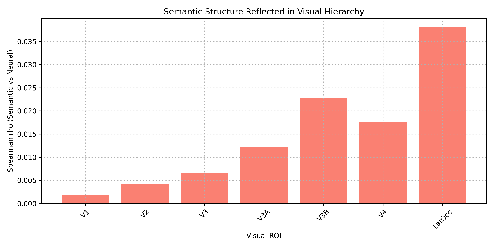
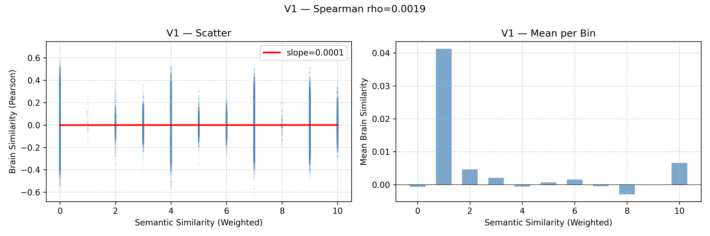
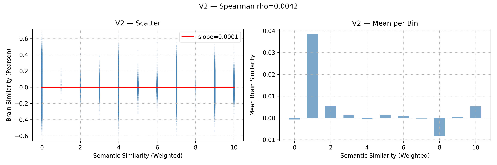
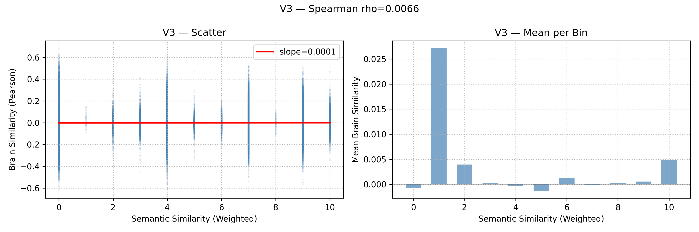
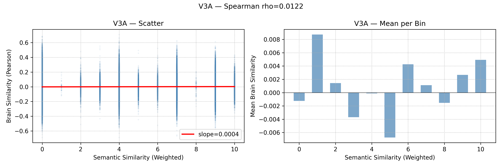
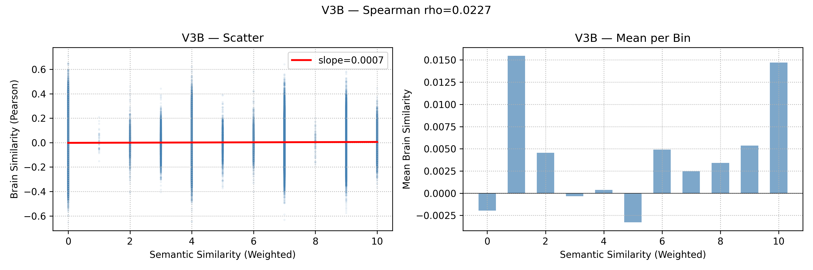
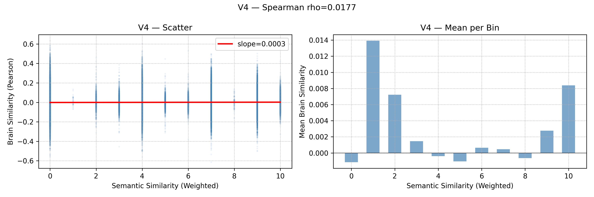
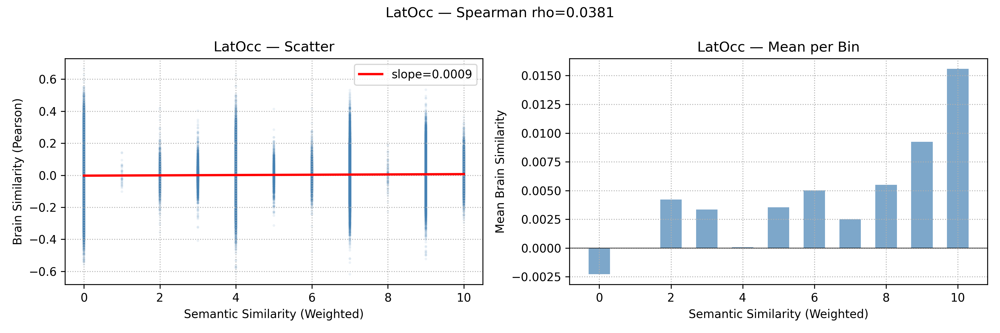

```markdown
# Tracking Semantic Representations Across the Visual Hierarchy
### A Representational Similarity Analysis of the Kay et al. (2008) fMRI Dataset

**Neuromatch Academy 2025 — Computational Neuroscience**  
**Team: Goofi Looki / Seemantic**  
Diana Naseh · Paniz Kheyri · Fereshteh Fathi · Erfaneh Hosseini

---

## 🧠 Background

The visual system processes information hierarchically — from low-level features 
(edges, orientation, spatial frequency) in early areas like V1, to high-level 
semantic representations in areas like Lateral Occipital Cortex (LatOcc).

**Core Question:**  
*Do semantically similar images evoke more similar neural activation patterns — 
and does this effect increase along the visual hierarchy?*

---

## 📊 Dataset

- **Source:** Kay et al. (2008) — *Identifying natural images from human brain activity*
- **Stimuli:** 1,750 grayscale natural images
- **Participants:** 2 subjects
- **ROIs:** V1, V2, V3, V3A, V3B, V4, LatOcc
- **Total voxels:** 8,428

> ⚠️ The raw fMRI data (`kay_images.npz`) is not included in this repository  
> due to file size. Download it from the original source and place it in `data/`.

---

## 🔬 Methodology

### 1. Semantic Similarity Matrix
Each image has 4 hierarchical semantic labels (broad → specific).  
Similarity between image pairs is computed using a weighted scoring system:

| Label Level | Weight |
|-------------|--------|
| Level 1 (broadest) | 4 |
| Level 2 | 3 |
| Level 3 | 2 |
| Level 4 (most specific) | 1 |

**Maximum score = 10** (identical at all levels)  
**Minimum score = 0** (no shared labels)

### 2. Neural Similarity Matrix
For each ROI:
- Voxel responses are **Z-scored** per voxel
- **Pearson correlation** between every pair of image response patterns
- Upper triangle extracted (~1.5 million unique pairs)

### 3. RSA — Representational Similarity Analysis
**Spearman correlation** between:
- Flattened semantic similarity vector
- Flattened neural similarity vector

This gives one **ρ (rho)** value per ROI — the degree to which  
semantic structure is reflected in neural representations.

---

## 📈 Results

### Main Finding: Semantic Gradient Across Visual Hierarchy



| ROI | Spearman ρ | p-value |
|-----|-----------|---------|
| V1 | 0.0019 | 0.019 |
| V2 | 0.0042 | 2.3e-07 |
| V3 | 0.0066 | 3.1e-16 |
| V3A | 0.0122 | 2.7e-51 |
| V3B | 0.0227 | 7.3e-174 |
| V4 | 0.0177 | 9.8e-106 |
| LatOcc | 0.0381 | ~0 |

**Key finding:** Spearman ρ increases monotonically from V1 to LatOcc,  
confirming that semantic information is increasingly encoded in higher visual areas.

### Semantic Similarity Matrix


### Per-ROI Scatter Plots
Each plot shows semantic similarity (x) vs. neural similarity (y),  
with regression line and mean-per-bin visualization.

| V1 | V2 | V3 |
|----|----|----|
|  |  |  |

| V3A | V3B | V4 | LatOcc |
|-----|-----|----|--------|
|  |  |  |  |

---

## 🗂️ Repository Structure

```
│
├── README.md
├── requirements.txt
│
├── notebooks/
│   ├── 01_load_and_explore.ipynb      # Data loading and exploration
│   ├── 02_semantic_similarity.ipynb   # Semantic similarity matrix construction
│   └── 03_neural_rsa.ipynb            # Main RSA pipeline
│
├── figures/                           # All plots and visualizations
├── results/                           # CSV result files
│   └── rsa_weighted.csv
│
└── data/
└── README.md                      # Data download instructions
```

---

## 🚀 How to Run

### 1. Clone the repository
```bash
git clone https://github.com/FereshtehFathi/NMA-Kay2008-semantic-RSA.git
cd NMA-Kay2008-semantic-RSA
```

### 2. Install dependencies
```bash
pip install -r requirements.txt
```

### 3. Download the data
Download `kay_images.npz` and `kay_labels.npy` and place them in `data/`.

### 4. Run notebooks in order
```
01_load_and_explore.ipynb
02_semantic_similarity.ipynb
03_neural_rsa.ipynb
```

> ⚠️ Note: `02_semantic_similarity.ipynb` takes ~15 minutes to run  
> due to the 1750×1750 similarity matrix computation.

---

## ⚠️ Limitations

- **Small sample size:** Only 2 participants — results cannot be generalized
- **Sparse semantic matrix:** Most image pairs share no labels (score = 0),  
  limiting the dynamic range of the semantic predictor
- **Small effect sizes:** ρ values are statistically significant but small,  
  reflecting that semantic similarity explains only a fraction of neural variance
- **V3B > V4 anomaly:** V3B shows unexpectedly high ρ relative to V4,  
  likely due to its small voxel count (n=314) introducing noise

---

## 🔮 Future Directions

1. Use **CLIP or Word2Vec** embeddings for continuous semantic similarity  
   instead of discrete label matching
2. **Control for low-level features** (e.g., AlexNet Conv2 RDM) to isolate  
   purely semantic variance — as done in Yıldız et al. (2025)
3. **Permutation testing** for more robust statistical inference
4. **More participants** for generalizable results

---

## 📚 References

- Kay, K.N., Naselaris, T., Prenger, R.J., & Gallant, J.L. (2008).  
  *Identifying natural images from human brain activity.* Nature, 452, 352–355.
  
- Kriegeskorte, N., Mur, M., & Bandettini, P. (2008).  
  *Representational similarity analysis.* Frontiers in Systems Neuroscience.

- Yıldız, U., Kelbakh, A., Yüce, B., & Zhuang, T. (2025).  
  *Representation of Semantic Encoding in Low and Intermediate Level Visual Regions.*  
  Neuromatch Academy Impactful Scholars Program.
